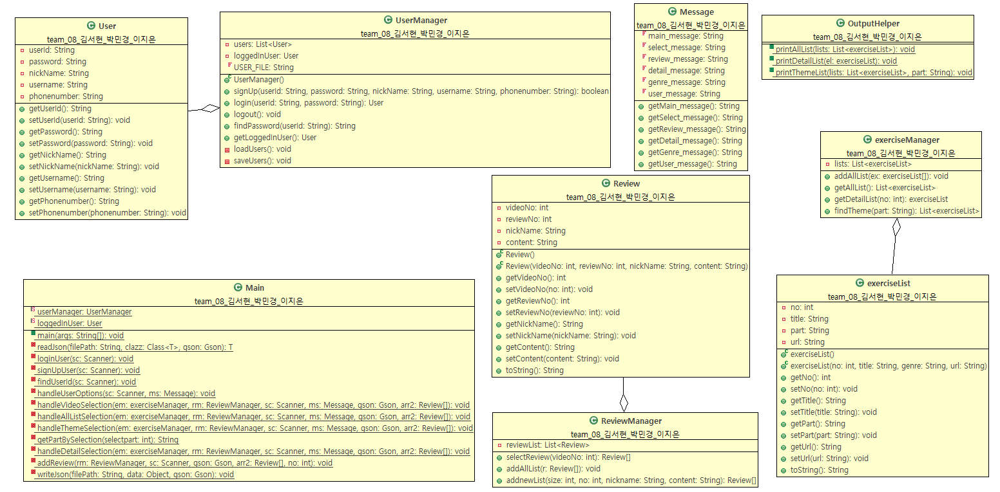

# SSAFIT 자바 프로그램

이 프로젝트는 자바로 구현된 운동 영상 관리 및 리뷰 시스템입니다. 
사용자 로그인 및 회원가입 기능을 제공하며, 
운동 영상을 조회하고 리뷰를 작성할 수 있는 기능을 포함하고 있습니다.

## 프로젝트 구조

- 

- `Main.java`: 프로그램의 메인 클래스. 사용자의 입력을 받아 다양한 기능을 처리합니다.
- `Message.java`: 사용자에게 출력되는 메시지를 관리하는 클래스입니다.
- `OutputHelper.java`: 운동 영상 목록 및 상세 정보를 출력하는 헬퍼 클래스입니다.
- `exerciseList.java`, `Review.java`, `UserManager.java`, `exerciseManager.java`, `ReviewManager.java`, `User.java`: 기타 필요한 데이터 클래스 및 관리 클래스입니다.

## 기능

1. **운동 영상 정보**
   - 전체 목록 조회
   - 테마(부위)별 영상 조회
   - 영상 상세 정보 조회

2. **사용자 정보 관리**
   - 회원 가입
   - 로그인
   - 아이디 찾기

3. **리뷰 작성**
   - 로그인한 사용자만 리뷰 작성 가능

## 사용 방법

1. **프로그램 실행**
   - `Main` 클래스를 실행하여 프로그램을 시작합니다.

2. **메인 메뉴**
   - 1: 영상 정보 조회
   - 2: 사용자 정보 관련
   - 3: 종료

3. **영상 정보 조회**
   - 1: 전체 목록 조회
   - 2: 테마(부위)별 영상 조회
   - 3: 처음으로 돌아가기

4. **사용자 정보 관련**
   - 1: 회원 가입
   - 2: 로그인
   - 3: 아이디 찾기

5. **리뷰 작성**
   - 로그인 후 영상 상세 정보에서 리뷰 작성

## JSON 파일 형식

- `data/video.json`: 운동 영상 목록을 저장하는 JSON 파일입니다.
- `data/review.json`: 운동 영상에 대한 리뷰를 저장하는 JSON 파일입니다.
- `data/user.json`: 사용자 정보를 저장하는 JSON 파일입니다.

## 예제

 1. 영상 정보    |    2. 사용자 정보 관련     |    3. 종료하기

   #### 1. 영상 정보
   이 옵션을 선택하면 비디오 목록을 선택할 수 있는 화면이 표시됩니다.

   
   ##### 1. 전체 목록
   전체 운동 비디오 목록을 조회할 수 있으며, 상세 정보를 선택할 수 있습니다.
   번호 제목 부위 URL
      예시 : 
      운동 제목1 상체 https://example.com/video1
      운동 제목2 하체 https://example.com/video2
      ...
   - **상세 보기**: 비디오의 상세 정보를 확인합니다.
   - **이전으로 돌아가기**: 목록 화면으로 돌아갑니다.

   ##### 2. 테마 우선 선택
   운동 비디오를 부위별로 필터링하여 조회합니다.

   1. 전신            |        2. 상체
   3. 하체            |        4. 복부
   5. 이전으로 돌아가기
   - **부위 선택 후**: 선택한 부위에 맞는 비디오 목록을 조회하고, 상세 정보를 선택할 수 있습니다.

#### 2. 사용자 정보 관련
이 옵션을 선택하면 사용자 정보 관련 작업을 수행할 수 있습니다.

   ##### 1. 회원 가입
   새로운 사용자로 가입할 수 있습니다.
   - **회원가입 성공**: 성공 메시지 출력
   - **회원가입 실패**: 실패 메시지 출력

   ##### 2. 로그인
   사용자 계정으로 로그인합니다.
   - **로그인 성공**: 로그인 메시지와 사용자 닉네임 출력
   - **로그인 실패**: 실패 메시지 출력

   ##### 3. 아이디 찾기
   아이디를 입력하면 비밀번호 찾기 기능이 수행됩니다.
   
   - **결과 출력**: 비밀번호 찾기 결과 메시지

   #### 3. 종료하기
   프로그램을 종료합니다.

   
## 주의사항
- **로그인 필요**: 리뷰를 작성하기 위해서는 로그인 상태여야 합니다.
- **파일 경로**: `data/video.json`과 `data/review.json` 파일의 경로가 정확해야 합니다.

### 로그인

